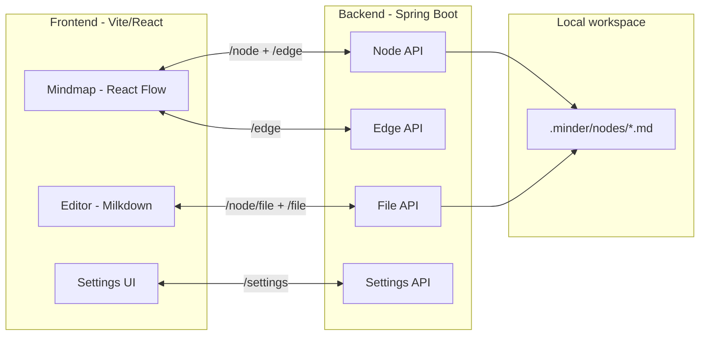
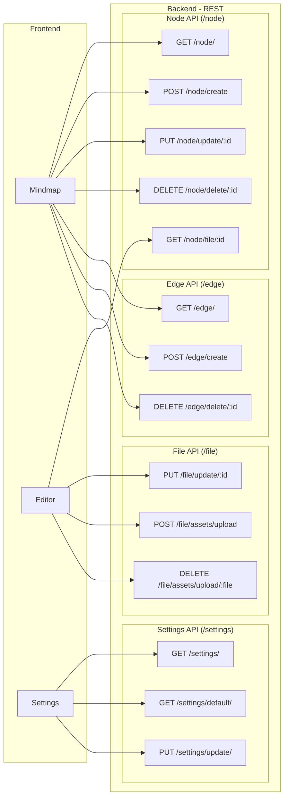

<div align="center">
  
  <h1>Minder</h1>
  <span>Your next favorite editor, offering more practicality and productivity in your studies.</span>
</div>

<br/>
<div align="center">


</div>

---

## Index
- [Overview](#overview)
- [Tech stack](#tech-stack)
- [Requirements](#requirements)
- [Quick start](#quick-start)
- [Clean architecture](#clean-architecture)
- [System design](#system-design-overview)
- [API design](#api-design-routes-and-flows)
- [Useful commands](#useful-commands)

## Overview
Minder is a Markdown editor for study notes. It keeps things focused on a mindmap: each node is a Markdown file, and edges link related ideas so you can jump around fast.

The system is split into:
- Frontend (Vite + React): mindmap UI and Markdown editor.
- Backend (Spring Boot): CRUD for nodes, edges, files, and settings.
- Local workspace: stores `.md` files and database.

## Tech stack
Frontend:
- React, Vite, TypeScript, TailwindCSS, React Flow, Milkdown.

Backend:
- Spring Boot, Java 21, H2, Spring Data JPA.

Infra:
- Docker + Docker Compose.

## Requirements
- Docker Engine with Docker Compose (plugin or docker-compose).
- Git to clone the repository.

## Quick start
Linux/macOS:
```bash
git clone https://github.com/orodrigojose/minder.git
cd minder/
ln -sf "$PWD/scripts/minder" "$HOME/.local/bin/minder"
chmod +x scripts/minder
minder up
```

Windows (PowerShell):
```powershell
git clone https://github.com/orodrigojose/minder.git
cd minder
$bin = "$HOME\bin"
New-Item -ItemType Directory -Force $bin | Out-Null
New-Item -ItemType SymbolicLink -Path "$bin\minder.cmd" -Target "$PWD\scripts\minder.cmd"
minder up
```

`minder up` creates `.env` if missing and opens the app at `http://localhost:8080`.

If an existing H2 database was created with different credentials, set `SPRING_DATASOURCE_USERNAME` and `SPRING_DATASOURCE_PASSWORD` in `.env`.

## Clean architecture
Backend follows a Clean Architecture layout:
- `domain`: core entities and business rules.
- `application/usecases`: application services and orchestration.
- `adapters/inbound`: REST controllers.
- `adapters/outbound`: JPA repositories and persistence adapters.
- `infrastructure`: shared configs, exception handlers, and response DTOs.

## System design (overview)


## API design (routes and flows)


## Useful commands
- `minder up [workspace_path]`: start the app and create the workspace.
- `minder rebuild [workspace_path]`: rebuild the image and start the app.
- `minder down`: stop containers.
- `minder logs`: follow logs.
- `minder status`: show container status.
- `minder open`: open the app in the browser.
- `minder ls [workspace_path]`: list workspace files.

---
